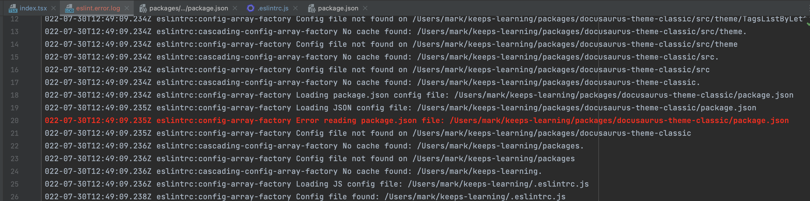
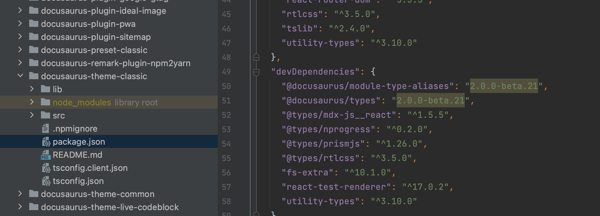
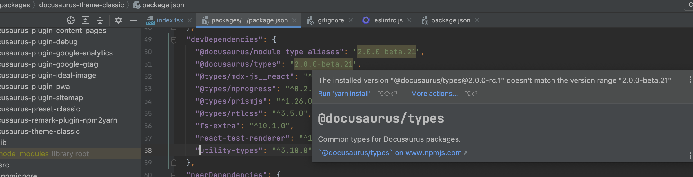
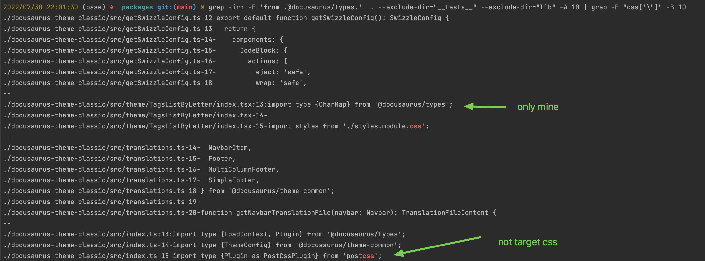
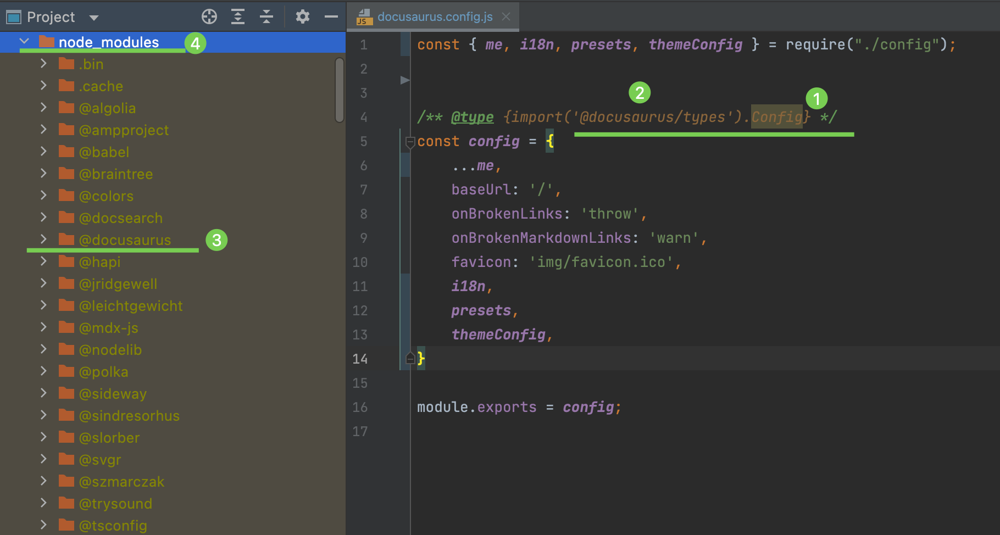
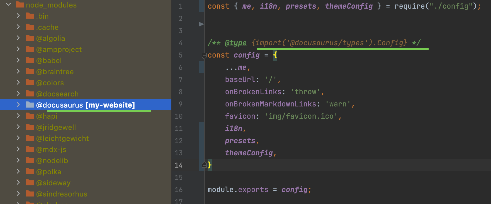

## Plugin Development

- doc: https://docusaurus.io/docs/api/plugins/@docusaurus/plugin-content-docs

## Todo

- [ ] 设置基于文件夹的默认列表页，允许对文件夹的引用（例如`../升学`），进行导航

  

- [ ] 追踪 slug，区分基于 mdx?或基于 tsx，增强 RouteConfig 数据结构，从而更好的溯源，比如对 slug 重复进行报错

## Howto

### 配置 Sidebar 部分章节打开

根据 [Autogenerated | Docusaurus](https://docusaurus.io/docs/sidebar/autogenerated#category-item-metadata) 配置如下：

[slam-sidebar-config](../../SLAM/_category_.yml)

## Bugfix

### fixed eslint import order problem

solution:

```sh
npx eslint packages/docusaurus-theme-classic/src/theme/TagsListByLetter/index.tsx --debug 2> eslint.error.log
```

Since I haven't initialized the workspace, the eslint does't work fully.







#### check import css followed after `@docusaurus/types`

run: `grep -irn -E 'from .@docusaurus/types.' . --exclude-dir="__tests__" --exclude-dir="lib" -A 10 | grep -E "css['\"]" -B 10`

result:



### 解决在 webstorm 中部分 type annotation 不起作用（但 vscode 可以）

问题：

如下，webstorm 的 Config 类就没有获得类型提示，原因很简单，就是因为对应的库被 webstorm 默认给 excluded 了：



解决方案：

只要把 `@docusaurus` 这个库右键 “cancel exclusion” 即可（秒 ok），另一种方法是对 `node_modules` 进行 “cancel exclusion”，但并不推荐，因为会拖慢 ide 的运行速度。


